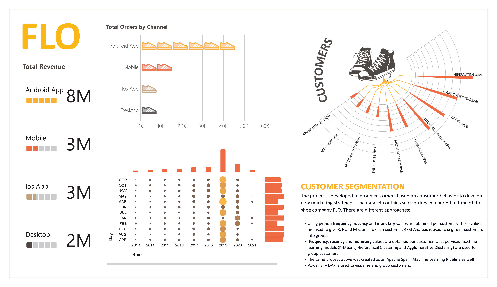
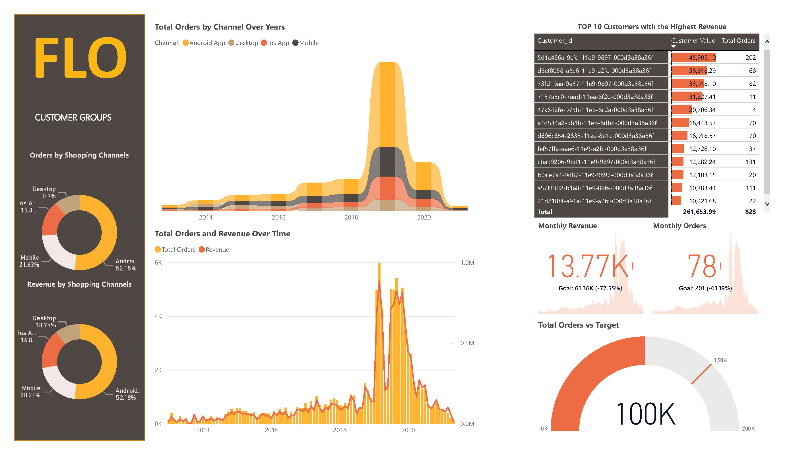
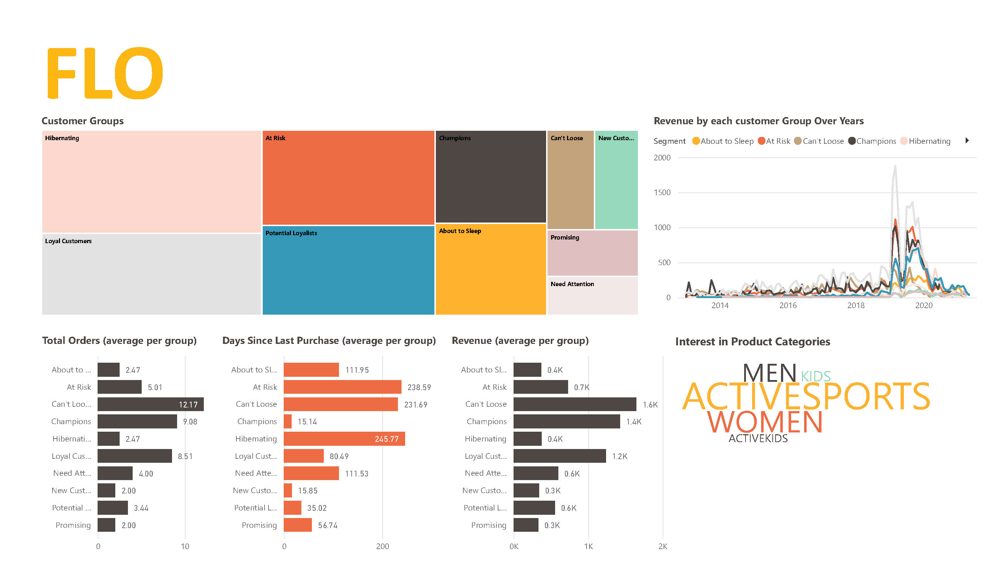

# FLO_Customers

#### -- Project Status: [Active]

## Project Intro/Objective

FLO is a famous shoes retail brand.

The company wanted to group their customers based on their consumption behaviour,in order to discuss/create new marketing strategies.

This project uses CRM (Customer Relationship Management) analytics - RFM (Recency, Frequency, Monetary) metrics in particular, 
unsupervised machine learning techniques and Spark to do a segmentation of FLO customers.

The consumption behaviours of individuals are defined and clusters / customer groups are formed with these techniques.

The purpose of this project is to compare the results of these different techniques.

Visualizations are done in Power BI

### Partner
* [FLO](https://www.flo.com.tr/)
* [Miuul](https://miuul.com/)

### Methods Used
* Inferential Statistics
* Machine Learning
* Data Visualization
* CRM Analytics
* RFM Techniques
* Spark Machine Learning
* etc.

### Technologies
* Python
* Pandas, jupyter
* Apache Spark
* Power BI
* etc.

## Project Description

## Getting Started

1. Clone this repo (for help see this [tutorial](https://help.github.com/articles/cloning-a-repository/)).
2. Data processing/transformation scripts are being kept [here](notebooks)
3. Spark machine learning scripts are being kept [here](src)

## Contributing Members
 - [Sibel Yasemin Ozgan](https://github.com/sibelyozgan)
